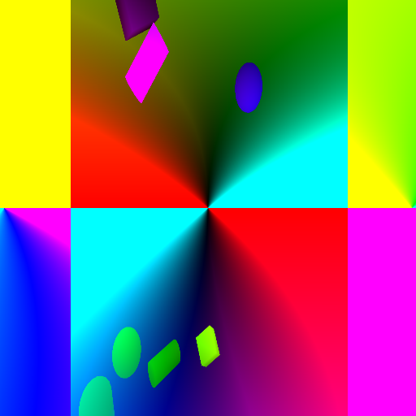
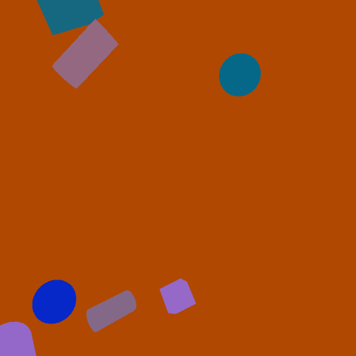
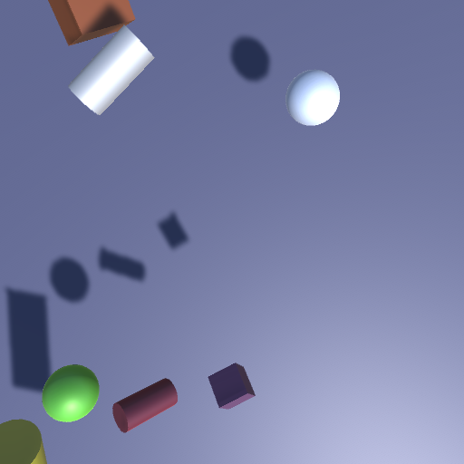
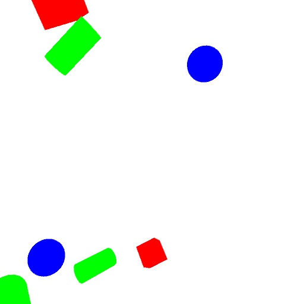

## Synthetic Data Generation Test
Test for generating synthetic training data for object detection with Unity.

Object groups are:
- Cylinder
- Sphere
- Cube

They are generated randomly, with varying color, size, rotation and location.

## Object Pooling
 Since generationg lots of objects every few frames and deleting them shortly after will overwhelm the memory, **object pooling** helps to enhance performance.

 This project makes use of **Unity Pooling API**. The API provides two groups of pools: 
 - `LinkedPool<T>` which use linked lists as underlying data structure that only occupies memory for actually used objects.  
 - `ObjectPool<T>` are based on Arrays and therefore occupies memory for a fixed number of objects.

The one used in this project is a `LinkedPool<T>` because the number of generated object of each group is random. An `ObjectPool<T>` would need to have the size the amount of objects to spawn, since in worst case only objects from one group could be spawned. That would lead to unnecessary occupied memory.

## Results

|||||
|:-:|:--:|:-:|:-:|
|Depth|| Optical flow ||

|||||
|:-:|:--:|:-:|:-:|
|Category|| Normal image ||

|||||
|:-:|:--:|:-:|:-:|
 |Labels / layers.|| Normal map ||

## Sources
- This software uses Unity ML-ImageSynthsis - see ImageSynthesis-Library.txt.
- Generating Synthetic Data for Image Segmentation with Unity and PyTorch/fastai - https://www.youtube.com/watch?v=P4CCMvtUohA
- OBJECT POOLING in Unity - https://www.youtube.com/watch?v=tdSmKaJvCoA